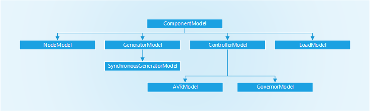

```@meta
CurrentModule = RMSPowerSims
```
# Component Model Guide

This page describes the type hierarchy of component models, outlines the function definitions required for implementation, and describes how to interpret documentation.

## Component Model Hierarchy

`RMSPowerSims` frequently utilizes Julia's multiple dispatch capabilities in model initialization and implementation. As such, each component model is defined by a custom type, which is a subtype of the type `ComponentModel`. This allows a common set of function names to be called on a range of component models. 

An abstract type hierarchy is used to differentiate between different types of common power system components. Each individual instance of one of these types will be handled the same by the package. The hierarchy of component model types used in RMSPowerSims is illustrated below:


#### ComponentModel

The `ComponentModel` type is defined as the highest level of the abstract type hierarchy used in RMSPowerSims. An concrete of a `ComponentModel` type (for example `SixthOrderModel`) contains all the parameters required to implement the equations that define the component.

#### NodeModel

Currently implemented as a concrete type instance. There is scope for expansion to incorporate the current balance form of a node model. See [NodeModel](node_models.md).

#### GeneratorModel

The `GeneratorModel` type is defined to incorporate the elements in the network that generate power. As such, the defining characteristic of a generator is that a component model of type GeneratorModel must include the variables `Pg` and `Qg`, representing active and reactive power injections to the network expressed on the system base value.

#### SynchronousGeneratorModel

The `SynchronousGeneratorModel` type specifies that variables be included for excitation voltage, `Efd`, and mechanical torque, `Tm`. This is done so that these variables to be implemented independently of the generator, allowing for definitions of AVR and governors to be separate from the instance of the `SynchronousGeneratorModel`. A `ConstantExcitation` or `ConstantMechanicalPower` will be connected automatically if no AVR or governor model is specified.

#### ControllerModel

The `ControllerModel` is included to implement generator control systems. Each instance of a `ControllerModel` is independent of the `GeneratorModel`. Connection of the two occurs during the process of building the `PowerSystemModel` by appropriately configuring pointers.

The `AVRModel` and `GovernorModel` subtypes are defined to provide a way for the package to identify whether a `ConstantExcitation` or `ConstantMechanicalPower` should be connected to a `SynchronousGeneratorModel`

#### LoadModel

The `LoadModel` type is defined to implement elements in the system that consume power. As such, it is defined that a component model of type `LoadModel` must include the variables `Pd` and `Qd`, representing active and reactive power drawn from to the network expressed on the system base value.

## Required Functions

This section details the commonly named functions that are used by the package to implement a given component model.

Note that the functions used to generate these docstrings are only for documentation purposes. Generic methods for these functions do not exist.

```@docs
variables
```
```@docs
differential_variables
```
```@docs
update!
```
```@docs
make_dynamic_model
```
```@docs
make_pointers_to_simulation_variables
```
```@docs
generate_ic!
```
```@docs
algebraic_equations!
```
```@docs
calculate_state_derivatives!
```

## Documentation

Documentation is provided for the type definition, `update!` function and `generate_ic!` functions of each component model type. 

The type definition documentation for each contains
- Definitions of the model parameters

The `update!` function definition contains
- Definitions of the variables used by the model. State variables refer to variables for which a derivative appears in the equations. Algebraic variables refer to variables for which a derivative does not appear. External variables refers to variables of other components that are required for simulation
- The equations that define the model.

The `generate_ic!` documentation contains
- Details of how the initial conditions of the component are calculated.
